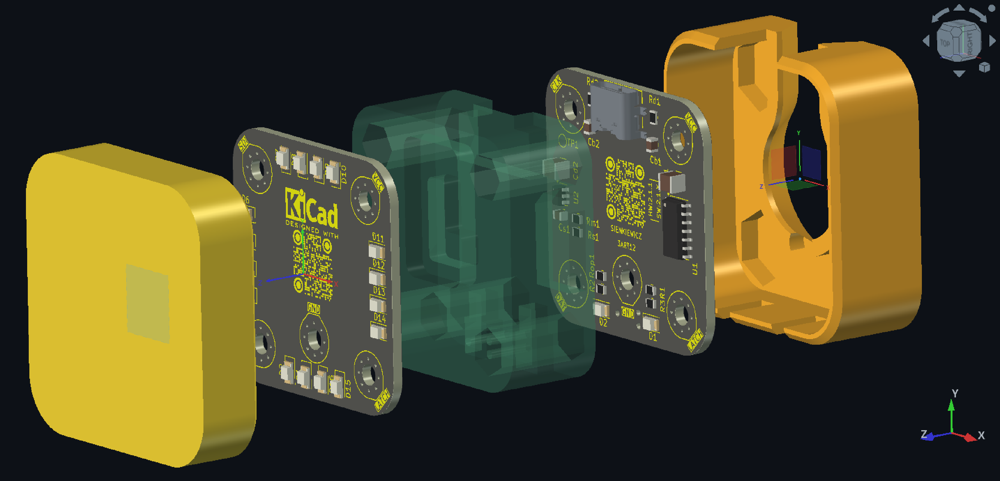

<!-- Begin README -->

<div align="center">
    
</div>

<p align="center">
    <a href="https://daringfireball.net/projects/markdown/"></a>
    <a href="https://github.com/bajraan"></a>
    <a href="mailto:bajran1616@gmail.com"></a>
    <br>
</p>


> [!IMPORTANT]
> **Updating system repository with latest submodules**

```bash
git submodule update --remote
git status
git add .
git commit -m "Update submodules"
git push
```